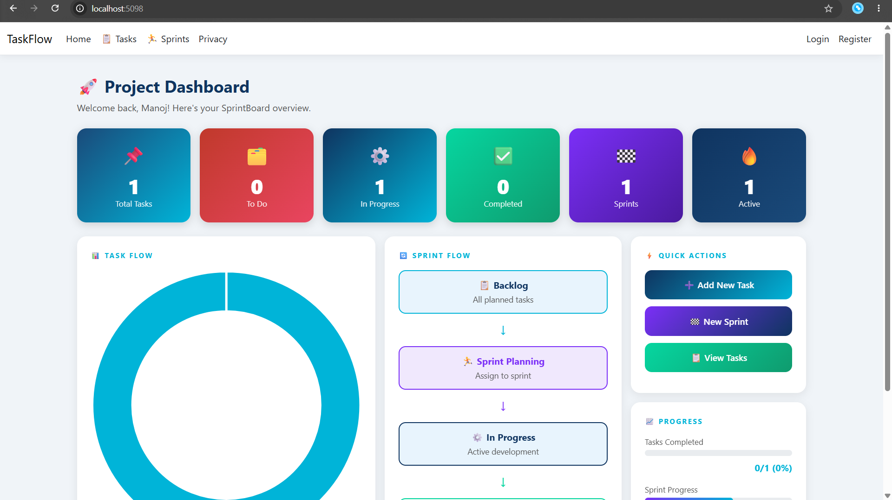
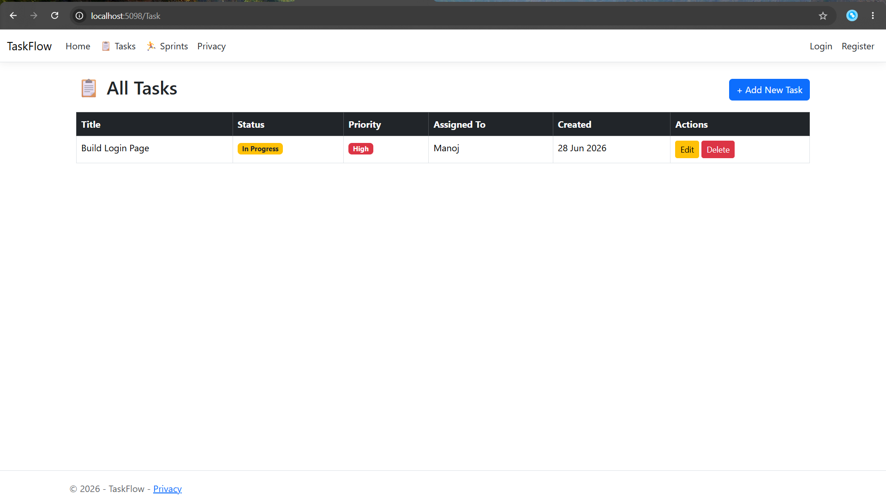
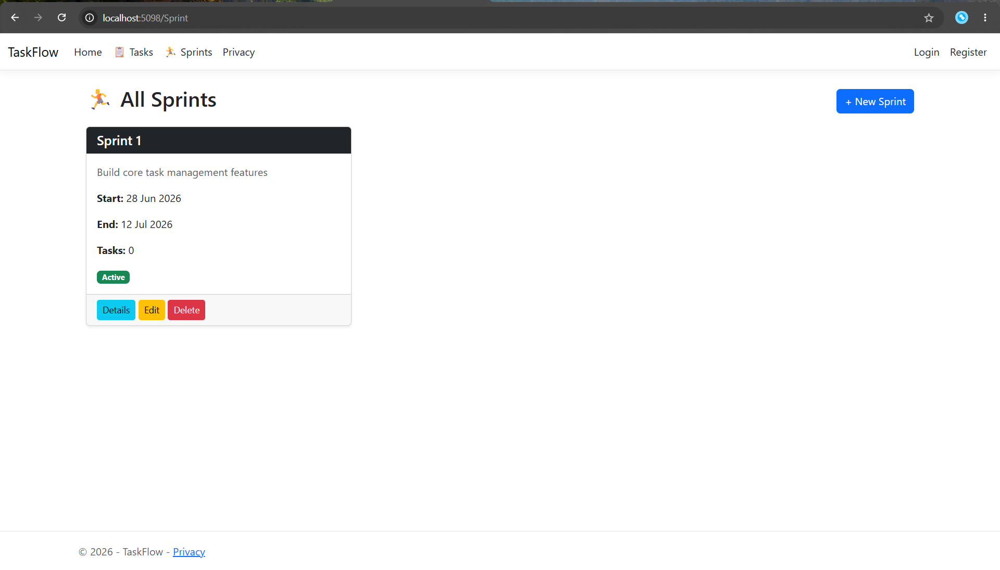

  

<h1 align="center">🚀 SprintBoard</h1>

  <b>Agile Project Management System built with ASP.NET Core MVC</b>

  
  
  
  

---

# 🚀 Why This Project Matters

Managing software projects without structure leads to delays, confusion, and poor delivery tracking.

**SprintBoard** solves this by providing a clean Agile-based workflow for:
- Sprint planning
- Task tracking
- Progress visualization
- Team-level project management

It demonstrates real-world **software engineering + full-stack .NET development skills**.

---

# ⚙️ System Workflow

`User Login` ➔ `Create Sprint` ➔ `Add Tasks` ➔ `Track Progress` ➔ `View Dashboard Analytics`

---

# ✨ Key Features

- 🔐 Authentication (ASP.NET Identity)
- 📅 Sprint Management (CRUD)
- 📝 Task Management System
- 📊 Dashboard Analytics with Charts
- 📈 Progress Tracking
- 🎨 Clean Dark UI Design
- ⚡ Entity Framework Core Integration

---

# 🖼️ Screenshots

## 📊 Dashboard

  

## 📝 Task Management

  

## 📅 Sprint Management

  

---

# 🧠 Architecture
